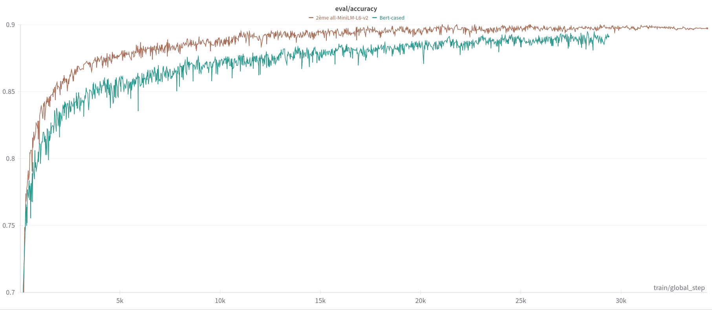
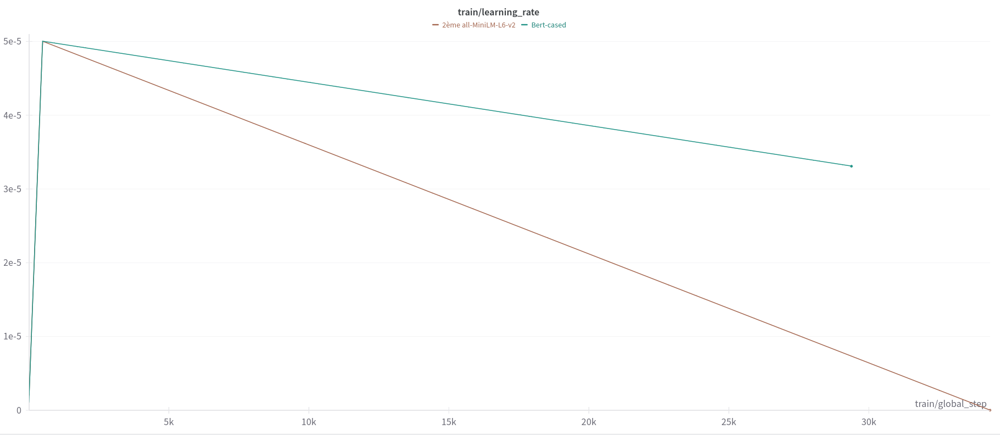
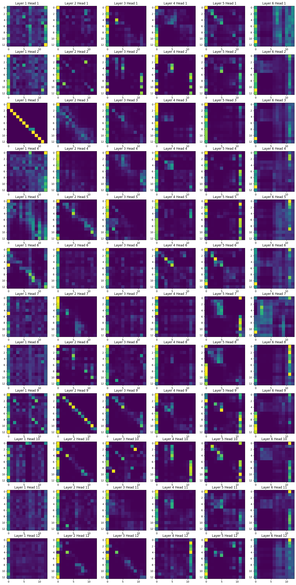

## Abstract

In this project, we worked on the Natural Language Inference (NLI) task. 

We used [The Stanford Natural Language Inference (SNLI) Corpus](https://nlp.stanford.edu/projects/snli/) to train a transformer model to classify the relationship between two sentences as : 1. entailment, 2. contradiction, or 3. neutral.

Our approach was the contatenation of the two sentences with special tokens to feed the model. We used the [all-MiniLM-L6-v2](https://huggingface.co/voidful/all-MiniLM-L6-v2) model and achieved an accuracy of **0.9** on the validation set, which is on par with the state-of-the-art models. 

# Projet NLI

## *Architecture de notre projet*

* **Dossier project**: contient les logs des sbatch (logslurms), un notebook pour visualiser les données, les results (checkpoints), notre config, notre dataloader et le modèle.

* un notebook **play** qui propose à l'utilisateur de rentrer deu xphrases et d'appliquer à ces phrases notre modèle.

* un notebook **attention** qui illustre les méchanismes d'attention au sein de notre modèle.

* un fichier python **train** qui se lance via le fichier bash **submit_slurms** pour lancer des sbatch lorsque l'on veut réaliser un finetuning.

* un notebook **test**, pareil que le notebook **train** mais pour lancer en local et tester notre modèle.

## *Dataset*

Voici, à titre indicatif un **leaderboard des modèles avec leur performance respective pour la tâche de NLI sur le dataset** que l'on étudie. Même s'il n'est pas extrêment récent, il pourra nous donner une idée des caractéristique de notre dataset et de ce que sera une bonne performance sur ce dataset.

[Dataset Leaderboard](https://nlp.stanford.edu/projects/snli/)

Vous pourrez trouver dans le fichier **load_visualize** du dossier notebooks quelques commandes nous ayant permis de prendre en main le dataset.

Vous trouverez aussi dans le notebook **test** le code pour prendre en main le dataset, le charger et créer un dataloader.

## *Preprocessing*

Pour le preprocessing de nos données nous avons choisis d'extraire à chaque fois l'hypothesis et le premise, de les tokenizer puis de concatener les deux vecteurs afin de ne donner en entrée à notre modèle qu'un seul vecteur et son label. Les deux phrases étant délimitées par des séparateurs au sein du vecteur, on ne perd pas d'information en effectuant cette opération.
Par exemple les premières lignes preprocess de notre dataset sont les suivantes:

```
[CLS] a person on a horse jumps over a broken down airplane. [SEP] a person is training his horse for a competition. [SEP] [PAD] [PAD]
```
On remarque l'utilisation des token spéciaux [CLS] pour le début de la phrase et [SEP] pour la délimitation des deux phrases. On ajoute aussi des [PAD] pour compléter les phrases et avoir des inputs de même taille.

Vous pouvez trouver notre dataloader dans le fichier **data_utils** au sein du dossier **project**.


## *Nos modèles*

Pour le choix du modèle nous nous sommes inspiré de la documentation suivante, qui présente le leaderboard des modèles pour le Massive Text Embedding:

[Model Leaderboard](https://huggingface.co/spaces/mteb/leaderboard)

* Nous avons tester plusieurs modèle (Bert, Roberta et all-MiniLM-L6-v2) pour réaliser notre tâches et avons opté pour all-MiniLM-L6-v2 au vu des bonnes perfoamnces qu'il obtenait en comparaison des autres et de sa très petite taille. Il s'agit pour tous les trois de modèle transformers que nous avons adaptés pour réaliser la tâche de NLI.

* On a utilisé Wandb pour le suivi de nos expériences et pour le choix de nos hyperparamètres. Vous pouvez voir ci-dessous les courbes d'accuracy de Bert et all-MiniLM-L6-v2. Roberta n'a pas été retenu car il n'obtenait pas de bonnes performances.




* Comme vous pouvez le voir, on a atteint une accuracy d'evaluation de **0.9** avec all-MiniLM-L6-v2, le test nous donne un score de **0.89** (voir le notebook **test**).

* Nous avons choisi l'optimizer AdamW au vu des bonnes performances qu'il présentait en comparaison de SGD.

* Enfin pour la métrique, comme nous avons afaire à une  tâche de classification nous avons trouvé pertinent de prendre l'accuracy.

* Pour le scheduler, nous avons choisi d'appliquer un warmup pendant les 500 premières itérations puis de réduire le learning rate progessivement.



* Pour tout les autres hyperparamètres du modèle, nous avons choisi la taille des batch et réduit le max_length de chaque input pour respecter les limitations imposées par la mémoire des GPU.

## *Visualisation de l'attention*

* Avec notre meilleur modèle : all-MiniLM-L6-v2, nous avons étudié les couches d'attention du modèle entrainé. Comme vous pouvez le voir dans la figure ci-dessous, ce modèle possède 12 couches et 12 têtes d'attention. 12 couches signifie 6 couches d'attention et 6 couches de feedforward. Chaque couche d'attention possède 12 têtes d'attention.

* Chaque image représente la matrice d'attention d'une tête d'attention pour une couche donnée. Chaque pixel de l'image représente l'attention d'un token de la phrase source sur un token de la phrase cible.

* Les premières couches sont les plus interprétables car dans les suivantes les feedforward ont beaucoup mélangé les informations.

* On peut remarquer plusieurs spécificités montrant le bon apprentissage du modèle:
    * Layer 1 Head 3: Le modèle fait de l'attention sur le token précédent.
    * Layer 2 Head 9: Le modèle fait de l'attention sur le token suivant.
    * Layer 1 Head 1 et autres: Les tokens [CLS] et [SEP] ont une attention très forte sur les tokens de la phrase source et cible. Cela montre que le modèle a bien appris à les utiliser pour la classification.
    * Layer 1 Head 5: Le modèle fait de l'attention sur les tokens de la phrase source et cible qui sont les plus proches.




## *Annexe: Prise en main du code*

Commandes pour lancer des sbatch sur le DCE pour le finetuning:

Se créer un environnement virutel et installer les requirements :
```
python3 -m pip install virtualenv --user
virtualenv -p python3 venv
source venv/bin/activate
python -m pip install -r requirements.txt
```

Lancer le sbatch avec `sbatch submit_slurms.sh` et cancel avec `scancel <job_id>`

Tout peut être lancé en local dont les notebooks **test**, **play** et **attention**.