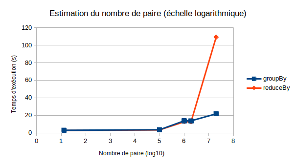
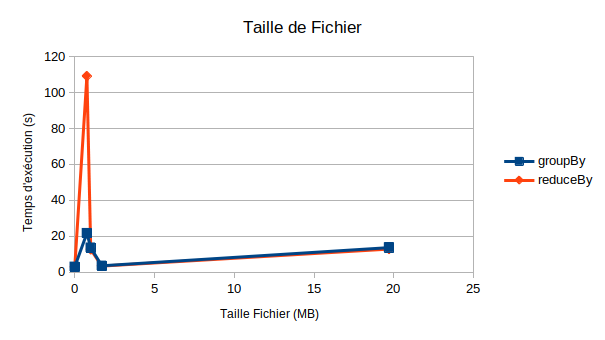
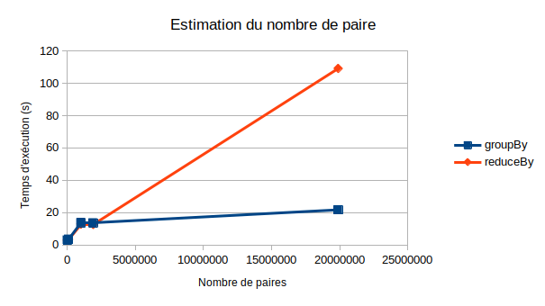
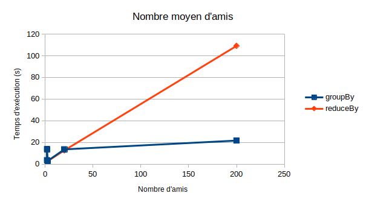
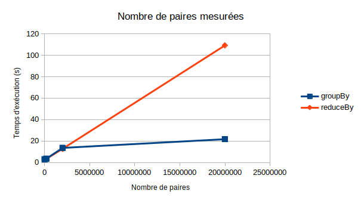
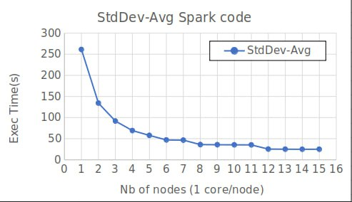

# TP-1 : Algorithmique distribuée en Spark
         
<p style="text-align:left;">
    Julien Cardinal & Eliott Py
    <span style="float:right;">
        29 septembre 2023
    </span>
</p>

## Exercice 1

### Question 1.1


```python
def avg_temperature_slow(theTextFile):
    avg = theTextFile 					                    \
        .map(lambda line: line.split(",")) 			        \
        .map(lambda term: (term[0],   [float(term[6])] ))   \
        .reduceByKey(lambda x, y: x+y) 		            	\
        .mapValues(lambda lv: sum(lv)/len(lv))
    return avg
```


| (short) input file name | 86400    | 2880     | 86        | 10     |
| ----------------------- | -------- | -------- | --------- | ------ |
| File size (MB)          | 0.36     | 10.5     | 9.0       | 3000.0 |
| Exec time(s)            | 2.894061 | 6.810580 | 84.494912 | X      |

Dans le fichier *temperatures_86.csv* on a une unique clé (l'année 1980) alors que dans *temperature_2880.csv* on a l'ensemble des années. La présence d'une unique clé empêche la parallélisation sur d'autres coeurs, et entraîne une exécution plus longue.

<table>
<tr>
<th>`temperatures_86400.out/part-00000`</th>
<th>`temperatures_86400.out/part-00001`</th>
</tr>
<tr>
<td>
  
```bash
('1980', 8.890519125683058)
('1981', 7.69197260273973)
('1982', 8.039643835616436)
('1983', 7.071808219178077)
('1990', 7.1568493150685)
('1991', 7.5461095890410945)
('1993', 7.253232876712321)
('1994', 8.410767123287666)
('1995', 7.528136986301371)
('2002', 7.283972602739731)
('2003', 7.299616438356163)
('2004', 8.799262295081972)
('2007', 8.095095890410958)
('2010', 7.8286849315068485)
('2011', 7.027424657534245)
('2012', 7.631748633879778)
('2013', 8.159945205479453)
('2014', 7.41616438356164)
('2015', 7.788328767123292)
('2016', 8.337049180327872)
('2017', 7.345287671232872)
```
  
</td>
<td>

```bash
('1999', 8.316383561643828)
('2000', 7.492978142076501)
('2001', 7.805123287671236)
('2005', 7.556246575342469)
('2006', 6.5930136986301475)
('2008', 7.798415300546447)
('2009', 6.9566301369863055)
('2018', 8.23512328767123)
('1984', 7.295409836065566)
('1985', 7.235726027397261)
('1986', 6.838821917808219)
('1987', 7.62534246575342)
('1988', 7.112240437158471)
('1989', 6.946712328767123)
('1992', 8.149453551912572)
('1996', 6.896994535519121)
('1997', 7.921616438356164)
('1998', 7.359780821917801)
```

</td>
</tr>
</table>


### Question 1.2

```python
def avg_temperature_fast(theTextFile):
	avg = theTextFile                                       \
		.map(lambda line: line.split(","))                  \
		.map(lambda x : (x[0], (float(x[6]), 1)))           \
		.reduceByKey(lambda x,y : (x[0]+y[0], x[1]+y[1]))   \
		.mapValues(lambda x: x[0]/x[1])
	return avg
```

On obtient alors comme temps d'exécution :

| (short) input file name | 86400    | 2880     | 86       | 10        |
| ----------------------- | -------- | -------- | -------- | --------- |
| File size (MB)          | 0.36     | 10.5     | 9.0      | 3000.0    |
| Exec time(s)            | 2.876008 | 3.217125 | 4.571166 | 22.703736 |

On retrouve des temps d'exécution bien plus faible, en particulier pour les fichiers plus volumineux. 
La différence en terme de temps d'exécution vient du nombre d'itération que l'on fait sur l'ensemble de nos valeures. Dans la moyenne "slow" on met l'ensemble des mesures d'une année dans une liste (dans le *reduceByKey*) puis on parcourt ces listes pour calculer la moyenne (dans *mapValues*). Dans la fonction *fast*, on ne parcourt qu'une seule fois nos mesures, en stockant directement la valeur de la somme et le nombre de mesures.


## Exercice 2

### Question 2.1

```python
# Function with groupByKey()
def common_friends(theTextFile):
    theCF = theTextFile                     \
        .map(lambda line: line.split(","))  \
        .flatMap(lambda t: [((x,y),t[0])    \
for x in t[1:] for y in t[1:] if x < y])    \
        .groupByKey()\
        .mapValues(lambda x: list(x))
    return theCF
```

```python
# Function with reduceByKey()
def common_friends(theTextFile):
    theCF = theTextFile                     \
        .map(lambda line: line.split(","))  \
        .flatMap(lambda t: [((x,y),[t[0]])  \
for x in t[1:] for y in t[1:] if x < y])    \
        .reduceByKey(lambda v1,v2: v1+v2)   \
        .mapValues(lambda x: list(x))
    return theCF
```
\pagebreak

On a comme résultats :

<table>
<tr>
<th>`sn_tiny.csv`</th>
<th>`sn_tiny.out`</th>
<th>graph</th>
</tr>
<tr>
<td>
  
```bash
F,E,D
C,D,A
A,B,D,C
B,A,D
E,D,F
D,A,F,C,B,E
```
  
</td>
<td>

```bash
(('D', 'E'), ['F'])
(('A', 'D'), ['C', 'B'])
(('B', 'D'), ['A'])
(('D', 'F'), ['E'])
(('A', 'F'), ['D'])
(('A', 'B'), ['D'])
(('A', 'E'), ['D'])
(('B', 'F'), ['D'])
(('B', 'E'), ['D'])
(('E', 'F'), ['D'])
(('A', 'C'), ['D'])
(('C', 'F'), ['D'])
(('C', 'E'), ['D'])
(('B', 'C'), ['D', 'A'])
(('C', 'D'), ['A'])
```

</td>

<td>
{ width=200px }
</td>
</tr>
</table>

Ce qui correspond bien aux résultats attendus par la fonction common_friends


### Question 2.2


|     Input file                                       |     sn_tiny     |     sn_10k_100k     |     sn_100k_100k    |     sn_1k_100k     |     sn_1m_1m    |
|------------------------------------------------------|-----------------|---------------------|---------------------|--------------------|-----------------|
|     File size (MB)                                   |     0.000043    |       1.0028        |        1.7          |    0.7639          |    19.7         |
|     groupBy (s)                                      |     3.042063    |    13.655134        |      3.607677       |     21.743480      |    13.693224    |
|     reduceBy (s)                                     |     2.814872    |    12.662398        |      3.433651       |    109.108914      |   12.901155     |
|     Min nb Amis                                      |       2         |       5             |        0            |      153           |      0          |
|     Max nb Amis                                      |      5          |       39            |      12             |     248            |      12         |
|     Avg nb Amis                                      |    2.66666      |      20             |        2            |     200            |       2         |
|     *Nb Nodes*                                       |       6         |      10k            |        100k         |     100k           |       1M        |
|     Estimated   nb_inter_pairs                       |       13        |         1900k       |       100k          |      19900k        |       1M        |
|     Measured   nb_inter_pairs                        |       17        |     1999916         |      199594         |     19996548       |    2000391      |

\pagebreak

### Question 2.3

```python
# Function to compute min max mean of the neighboors
def min_max_mean(theTextFile):
    theCF = theTextFile                                 \
        .map(lambda line: line.split(","))              \
        .map(lambda t: (len(t)-1,len(t)-1,len(t)-1,1))  \
        .reduce(lambda v1,v2: (min(v1[0],v2[0]),        \
max(v1[1],v2[1]),v1[2]+v2[2],v1[3]+v2[3]))
    return (theCF[0],theCF[1],theCF[2]/theCF[3])
```

Ici on peut afficher (print) directement le résultat car c'est un `tuple` python


### Question 2.4

On suppose que que chaque noeud possède un nombre d'amis égal au nombre d'ami moyen n. 
Or on parcours en triangle les amis de chaque noeud pour un total de $\frac{n(n-1)}{2}$ double ami par noeud
On somme, cela donne $\frac{n(n-1)NbNodes}{2}$


### Question 2.5

Pour récupérer le nombre réel de paires intermédiaires, on prend la même fonction que tout à l'heure (common friends) mais on somme uniquement des 1 (cela améliore aussi le temps de calcul) :

```python
def nb_intemediate_pairs(theTextFile):
    theCF = theTextFile                                                 \
        .map(lambda line: line.split(","))                              \
        .flatMap(lambda t: [(1) for x in t[1:] for y in t[1:] if x < y])\
        .reduce(lambda v1,v2: v1+v2)
    return theCF
```

Ici on peut aussi print le résultat car c'est un `int`

{ width=430px }

La figure ci-dessus donne le temps d'éxécution en fonction du nombre de paires générées par la fonction. On observe que le temps est croissant en fonction du nombre de pair, il décrit une droite en échelle log pour le programme group by (évolution exponentielle) alors que le programme reduceBy explose complètement (plus qu'exponentiel)

Cela peut s'expliquer par la lenteur à faire une concaténation de liste (reduceBy), comparé à la façon optimisée de rassembler les éléments de groupBy

\pagebreak

### Question 2.6


Propriétés du problème             |  Nombre de paires
:-------------------------:|:-------------------------:
  |  
||

La **taille de fichier** et le **nombre moyen d'amis** ne semblent pas être des éléments de comparaison pertinents car il y a une bosse dans les valeurs faibles qui ne donne pas de plus grand temps de calcul.
Les courbes du temps d'éxécutions en fonction du **nombre de paires** sont quant à elles bien monotones et nous permettent de caractériser au mieux le temps d'éxécution.

## Exercice 3

### Question 3.1

Pour notre calcul d'écart-type, on utilise un raisonnement très similaire au calcul rapide de moyenne. On rajoute une 3e valeur dans notre méthode *map* qui stocke le carré de notre mesure. On peut alors sommer les carrés lors de notre *reduceByKey* et effectuer un calcul simple lors de notre *mapValue* de fin. Le code :

```python
def sigma_temp(theTextFile):
	avg = theTextFile                                               \
		.map(lambda line: line.split(","))                          \
		.map(lambda x : (x[0], (float(x[6]), float(x[6])**2, 1)))   \
		.reduceByKey(lambda x,y : (x[0]+y[0], x[1]+y[1], x[2]+y[2]))\
		.mapValues(lambda x: (x[0]/x[2], math.sqrt((x[1]/x[2])-(x[0]/x[2])**2)))
	return avg
```

On obtient alors les résultats ci-dessous, avec des temps légèrement inférieurs à la méthode de calcul rapide de la moyenne, sauf pour le fichier *temperatures_10.csv*. Les temps "inférieurs" qui semblent absurdes au premier abord sont probablement causés par des délais interne au DCE et des marge d'erreur de temps d'exécution. On peut donc conclure que les temps d'exécution sont identiques à ceux de l'exercice 1 pour nos fichiers de petites tailles, mais on observe plusieurs secondes supplémentaires dans le traitement de *temperatures_10.csv* avec ses 3000 MB.


| (short) input file name | 86400    | 2880     | 86       | 10        |
| ----------------------- | -------- | -------- | -------- | --------- |
| File size (MB)          | 0.36     | 10.5     | 9.0      | 3000.0    |
| Exec time(s)            | 2.743598 | 3.300634 | 4.436893 | 25.241637 |


```bash
$ hdfs dfs -cat hdfs://sar17:9000/sdi-labworks-2023-2024/sdi-labworks-2023-2024_8/Exercice3/Question1/temperatures_86400.out/part-00000
('1980', (8.890519125683058, 11.414291324993409))
('1981', (7.69197260273973, 11.679658676252913))
('1982', (8.039643835616436, 11.789173144660772))
('1983', (7.071808219178077, 11.333152290511785))
('1990', (7.1568493150685, 11.857831962053929))
('1991', (7.5461095890410945, 11.72129034408994))
('1993', (7.253232876712321, 11.908342532748856))
('1994', (8.410767123287666, 11.701295465712573))
('1995', (7.528136986301371, 11.467971782453613))
('2002', (7.283972602739731, 11.845161215383575))
('2003', (7.299616438356163, 11.714004187273277))
('2004', (8.799262295081972, 12.262116312053427))
('2007', (8.095095890410958, 12.199611393052244))
('2010', (7.8286849315068485, 11.984577734575138))
('2011', (7.027424657534245, 11.757483513621898))
('2012', (7.631748633879778, 11.232164110423325))
('2013', (8.159945205479453, 12.095467213807215))
('2014', (7.41616438356164, 12.000489970606273))
('2015', (7.788328767123292, 11.422338877224695))
('2016', (8.337049180327872, 11.508239269066483))
('2017', (7.345287671232872, 11.692122262422554))
```

```bash
$ hdfs dfs -cat hdfs://sar17:9000/sdi-labworks-2023-2024/sdi-labworks-2023-2024_8/Exercice3/Question1/temperatures_86400.out/part-00001
('1999', (8.316383561643834, 11.924106724109313))
('2000', (7.492978142076501, 11.61512127459571))
('2001', (7.805123287671236, 11.71620310176408))
('2005', (7.556246575342469, 10.853734785248598))
('2006', (6.5930136986301475, 11.76059663067318))
('2008', (7.798415300546447, 11.90792669837008))
('2009', (6.9566301369863055, 11.653278350543932))
('2018', (8.23512328767123, 11.458240836489342))
('1984', (7.295409836065566, 12.268591233021146))
('1985', (7.235726027397261, 11.671738813845927))
('1986', (6.838821917808219, 12.337398028716253))
('1987', (7.62534246575342, 11.025529388985126))
('1988', (7.112240437158471, 11.92114388316714))
('1989', (6.946712328767123, 11.284652525260821))
('1992', (8.149453551912572, 12.2027320118838))
('1996', (6.896994535519121, 11.753683609782817))
('1997', (7.921616438356164, 11.006486250339291))
('1998', (7.359780821917801, 11.695995566035755))
```
\pagebreak

## Exercice 4

On observe pour les premiers points à gauche un temps important d'exécution, ce qui est cohérent avec une faille parallélisation des calculs. Cependant, on observe que lorsqu'on augmente encore plus le nombre de coeurs, le temps d'exécution semble ne plus diminuer qu'en palier (à 8 coeurs et 12 coeurs).


