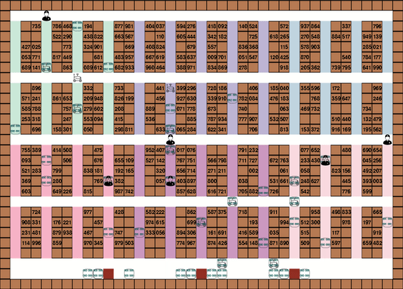

# Abstract

Multi-agent pathfinding in a warehouse. The robots must retrieve the boxes and bring them to the drop-off points. The robots must avoid collisions and take into account the movements of the other robots. The algorithm used is A* multi-agent pathfinding.

# Multi-agent pathfinding in a warehouse

### Order allocation

- Clustering according to proximity of order items
- Gradual allocation of orders to robots as shelves are retrieved
    
    -> Potential improvement: Allocation of new orders through non-overloaded operators

### Collision-free pathfinding - version 5

- Check for robots stuck / waiting on a square to avoid them
- Pathfinding with dijkstra to nearest box/drop-off point, taking other robots' movements into account

### Strategies
#### Strategy 1 - Detach if operator too far away

Calculate the distance to the next available shelf and compare with the operator's distance to the shelf. Detach if operator too far away.

-> In steady state / t large enough, most robots are blocked because a shelf is at the level of the last package to be retrieved. Everything jams -> Need strategy 2

#### Strategy 2 - Detach if blocked

Detach from the shelf if the robot gets stuck and can't reach its target.

-> Problem of robots coming and going, detaching and coming back because they think the shelf they've just left needs to be processed. -> Strategy 3 needed

#### Strategy 3 - List waiting shelves without blocked shelves

List of waiting shelves: ready to be retrieved by a robot according to these criteria:
- Shelf is not already connected / the target of another robot
- Shelf has been / will soon be processed by an operator
- Shelf not blocked**

#### Strategy 4 - Stuck robots move as close as possible to their target
A jammed robot will stop and impede traffic.
It usually gets stuck when picking up its last item. It's in our interest to stop close to this item, and not in the main thoroughfare.

-> Takes precedence over strategy 2 but compatible

#### Strategy 5 - Better Pathfinding
Robots now take into account the movements of other robots and can therefore follow each other in a corridor.
This principle works with marking the next move on the floor, according to the notations in "tableau_entrepot.md". The shortest path algo takes these markings into account.

-> Optimizes even when shelves are fixed.

